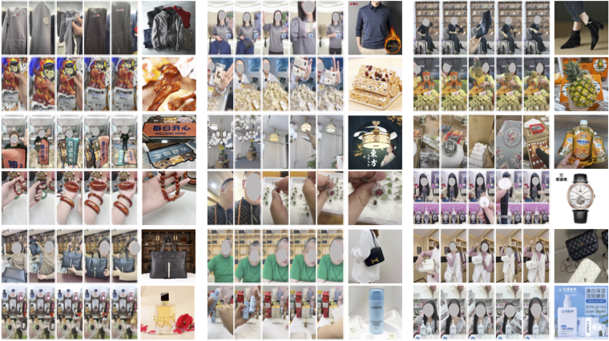

## The code of [Cross-view Semantic Alignment for Livestreaming Product Recognition](https://github.com/DeepAlchemist/crossview-semantic-alignment) is released!

## 1. LPR4M Introduction
___Livestreaming Product Recognition (LPR)___ is to recognize products a salesperson presents in a live commerce clip (or video) through content-based video-to-image retrieval.
A livestreaming consists of many clips introducing different products, and a shop with hundreds of images.
This task is to retrieve the ground-truth images from the shop (gallery) for each clip (query).

<p align="center">
  
</p>

LPR4M is a large-scale live commerce dataset, offering a significantly broader coverage of categories and diverse modalities such as video, image, and text. 

#### 1.1 Key Features
- Large-Scale: LPR4M is the largest LPR dataset to date. It contains 4M exactly matched〈clip, image〉pairs of 4M live clips, and 332k shop images. Each image has 12 clips with different product variations, e.g., viewpoint, scale, and occlusion.
- Expressivity: LPR4M draws data pairs from 34 commonly used live commerce categories rather than relying solely on clothing data. Additionally, LPR4M offers auxiliary clip ASR text and image title.
- Diversity: LPR4M promotes clip diversity while preserving the real-world data distribution, with a focus on three components: product scale, visible duration, and the number of products in the clip.

#### 1.2 Statistics

<p align="center">
  
</p>

- Full training set: A <clip, image> pair is the basic unit of the trainging set. 
The full training set contains 4,013,617 clips and 332,438 images, which results in 4,013,617 pairs. Each image has 12 clips on average. We extract one frame every second for the training clips and obtain 473,402,226 frames.
- Detection training set: The product detection in the clip can promote the LPR accuracy. Thus, we sampled a subset from the full training set as the training set for the product detector. We extract 10 frames at even intervals for each clip and obtain 1,120,410 frames with 1,115,629 annotated product boxes.
- Test set: The query set contains 20,079 clips, the gallery set contains 66,358 shop images. We adopt rank-k accuracy as the retrieval performance metrics. In order to evaluation of the performances of product detector, we extract one frame every 3 seconds for each query clip and obtain 501,656 frames with 669,374 annotated product boxes.

We created a url for each clip frame and shop image for easy download. 
<ins>*The human faces in the images are all masked.*</ins>


## 2. Download 
We organize the url data of the dataset into four *txt* files. One url one row.
- training_frame_url_full_473402226.txt: the 473,402,226 frame urls of the full training clips.
- training_image_url_full_332438.txt: the 332,438 shop image urls of the training set.
- test_frame_url_501656.txt: the 501,656 frame urls of the test clips.
- test_image_url_66358.txt: the 66,358 shop image urls of the test set.

#### 2.1 Frame url example
```bash
https://js-ad.a.yximgs.com/bs2/ad-material-video/7b601b02-2c63-11ee-bb6d-b8cef60c2fd0-1667916122888-1667916252390-0081.jpg
```
An example of frame url, where `https://js-ad.a.yximgs.com/bs2/ad-material-video/` is the prefix, 

`7b601b02-2c63-11ee-bb6d-b8cef60c2fd0` is the livestreaming id (live_id), 

`1667916122888-1667916252390` indicates the start and end timestamp of the livestreaming. 

Thus, `live_id-start_timestamp-end_timestamp` represents a unique clip_id, which means that the clip is cropped from live_id, and the cropping starts from `start_timestamp` and ends at `end_timestamp`.

`0081` is the frame index in current clip_id, and `live_id-start_timestamp-end_timestamp-frame_index` represents a unique frame_id.

#### 2.2 Shop image url example
```bash
https://js-ad.a.yximgs.com/bs2/ad-material-video/fff8b484-2eeb-11ee-b7bb-77cb20e634dc.jpg
```
An example of shop image url, where *fff8b484-2eeb-11ee-b7bb-77cb20e634dc* is the image id.

#### 2.3 Download the url files
To download the LPR4M data, please first [sign the agreement](https://docs.google.com/forms/d/e/1FAIpQLSeVLnR_CVGmq-Db5zwUEcqopgb7a-uPUZnRfBzDSgkGrJ2G6g/viewform?usp=sharing).
We will email you the download link of the four url files. These *txt* file links are valid for 7 days, please download the *txt* files in time before they expire.

#### 2.4 Install *img2dataset*
```bash
pip install img2dataset
```
***img2dataset*** can easily turn large sets of image urls to an image dataset. :fire:<ins>*It can download, resize and package 100M urls in 20h on one machine.*</ins> :fire:For example, [LAION-5B](https://laion.ai/blog/laion-5b/) contains 5B urls of image/text pairs that can be downloaded by ***img2dataset*** in 7 days using 10 nodes. For better performance, it's highly recommended to set up a fast dns resolver, see [this section](https://github.com/rom1504/img2dataset#setting-up-a-high-performance-dns-resolver). You can refer
to [img2dataset](https://github.com/rom1504/img2dataset) for more details.

#### 2.5 Download the full dataset
After downloading the url files and installing *img2dataset*, you can proceed to download dataset. In order to facilitate the testing of *img2dataset*, we present [demo.txt](https://js-ad.a.yximgs.com/bs2/ad-material-video/demo.txt), which contains 1 million training frame urls.
- Firstly, download the demo url file:
```bash
wget https://js-ad.a.yximgs.com/bs2/ad-material-video/demo.txt
```
- Then, run the *img2dataset* tool:

```bash
img2dataset --url_list=demo.txt --output_folder=lpr4m_demo \
    --input_format txt --output_format files --image_size 256 --resize_mode keep_ratio \
    --number_sample_per_shard 50000 --timeout 10 --retries 0 --incremental_mode "incremental" \
    --processes_count 10 --thread_count=128 --distributor multiprocessing \
```
`--resize_mode keep_ratio` will keep the ratio and make the smallest side of the picture image_size. keeping ratio is important, because we should ensure the annotation box still fits the downloaded frames.

`--number_sample_per_shard` the number of sample that will be downloaded in one shard, when it is set to 50k, the shard number would be 1M/50k=20.

`--processes_count` set the processes_count as the number of cores your machine has

`--thread_count` increase thread_count as long as your bandwidth and cpu are below the limits

`--output_format` decides how to save pictures. *files* saves as a set of subfolder containing pictures, while *webdataset* saves as tars containing pictures.

:fire:For more details about the arguments, please refer to the [API](https://github.com/rom1504/img2dataset#api) of *img2dataset*.

- Finally, the tool will then automatically download the urls, resize them, and store them.

If the output_format is set to *files*, the images will be stored as:
```
- output_folder
    - 00000 (shard id)
      - 000000000.jpg
      - 000000000.json
      - 000000001.jpg  (i.e., 00000-00001, shard_id-image_index)
      - 000000001.json
```

The json file 000000001.json records some messages of the frame.
```
{
  "url": "https://js-ad.a.yximgs.com/bs2/ad-material-video/7b601b02-2c63-11ee-bb6d-b8cef60c2fd0-1667916122888-1667916252390-0081.jpg"
  "key": "0000000001"
  "status": "success"
  "error_message": "null"
  "width": "256"
  "height": "455"
  "original_width": “540”
  "original_height": “960”
  "exif": “{}”
  "sha256": "4172f55eb0d90a2bd2eb94092ecb9e45dcd448ecce47acb6fdd85fb11befbd4e"
}
```


## 3. Annotation Description
All annotation labels of the dataset are as follows：
- [training_videoinfo_full_4013617.txt](https://js-ad.a.yximgs.com/bs2/ad-material-video/training_videoinfo_full_part_00.txt) : One video one row. Each row consists of <ins>[1] video_id, [2] frame_id list of video_id, [3] box list of frame_id, [4] image_id, [5] image_title, [6] category id, [7] category name, [8] video asr, [9] product scale type, [10] product visible duration type, [11] product number type</ins>, separated by \t. We split the full file into 10 subfiles, the url of the *i*-th file is https://js-ad.a.yximgs.com/bs2/ad-material-video/training_videoinfo_full_part_i.txt
- [test_videoid_asr_20079.txt](https://js-ad.a.yximgs.com/bs2/ad-material-video/test_videoid_asr_20079.txt) : ASR of testset videos.  Each row consists of <ins>video_id, video_asr</ins>, separated by \t.
- [test_image_title_6076.txt](https://js-ad.a.yximgs.com/bs2/ad-material-video/test_image_title_6076.txt) : Title of testset images. Each row consists of <ins>image_id, image_title</ins>, separated by \t.
- [test_videoid_to_gtimage_20079.json](https://js-ad.a.yximgs.com/bs2/ad-material-video/test_videoid_to_gtimage_20079.json) : A dict, key is video_id, value is the ground-truth image list of the video_id.
- [test_frameid2gtbox_20079_426751.json](https://js-ad.a.yximgs.com/bs2/ad-material-video/test_frameid2gtbox_20079_426751.json]) : A dict, key is frame_id of testset, value is the bounding box labels.
- [test_liveid_to_gallery_110.json](https://js-ad.a.yximgs.com/bs2/ad-material-video/test_liveid_to_gallery_110.json) : A dict, key is live_id, value is the gallery image list of live_id. The testset has 110 livestreaming ids in total.  All the test videos are cropped from the 110 livestreamings. Given a query video cropped from live_id *a-b-c-d-e*, the gallery set is the value of *a-b-c-d-e*.

## Citation

```bibtex
@InProceedings{Yang_2023_ICCV,
    author    = {Yang, Wenjie and Chen, Yiyi and Li, Yan and Cheng, Yanhua and Liu, Xudong and Chen, Quan and Li, Han},
    title     = {Cross-view Semantic Alignment for Livestreaming Product Recognition},
    booktitle = {Proceedings of the IEEE/CVF International Conference on Computer Vision (ICCV)},
    month     = {October},
    year      = {2023},
    pages     = {13404-13413}
}
```
