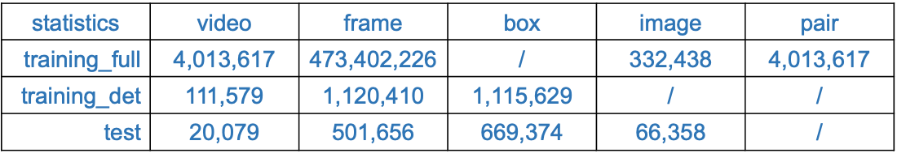

Livestreaming Product Recognition (LPR) is to recognize products a salesperson presents in a live commerce clip (or video) through content-based video-to-image retrieval.
A livestreaming consists of many clips introducing different products, and a shop with hundreds of images.
This task is to retrieve the ground-truth images from the shop (gallery) for each clip (query).

<p align="center">
  
</p>

LPR4M is a large-scale live commerce dataset, offering a significantly broader coverage of categories and diverse modalities such as video, image, and text. 

Key Features
- Large-Scale: LPR4M is the largest LPR dataset to date. It contains 4M exactly matched〈clip, image〉pairs of 4M live clips, and 332k shop images. Each image has 12 clips with different product variations, e.g., viewpoint, scale, and occlusion.
- Expressivity: LPR4M draws data pairs from 34 commonly used live commerce categories rather than relying solely on clothing data. Additionally, LPR4M offers auxiliary clip ASR text and image title.
- Diversity: LPR4M promotes clip diversity while preserving the real-world data distribution, with a focus on three components: product scale, visible duration, and the number of products in the clip.

Statistics

<p align="center">
  
</p>

- Full training set: A <clip, image> pair is the basic unit of the trainging set. 
The full training set contains 4,013,617 clips and 332,438 images, which results in 4,013,617 pairs. Each image has 12 clips on average. We extract one frame every second for the training clips and obtain 473,402,226 frames.
- Detection training set: The product detection in the clip can promote the LPR accuracy. Thus, we sampled a subset from the full training set as the training set for the product detector. We extract 10 frames at even intervals for each clip and obtain 1,120,410 frames with 1,115,629 annotated product boxes.
- Test set: The query set contains 20,079 clips, the gallery set contains 66,358 shop images. We adopt rank-k accuracy as the retrieval performance metrics. In order to evaluation of the performances of product detector, we extract one frame every 3 seconds for each query clip and obtain 501,656 frames with 669,374 annotated product boxes.

We created a url for each clip frame and shop image for easy download.


## Download 
To download the LPR4M data, please first download the 

### Download files
### Install ***img2dataset***
```bash
pip install img2dataset
```
***img2dataset*** can easily turn large sets of image urls to an image dataset. It can download, resize and package 100M urls in 20h on one machine. For example, [LAION-5B](https://laion.ai/blog/laion-5b/) contains 5B image/text pairs that can be downloaded by ***img2dataset*** in 7 days using 10 nodes. For better performance, it's highly recommended to set up a fast dns resolver, see [this section](https://github.com/rom1504/img2dataset#setting-up-a-high-performance-dns-resolver). You can refer
to [img2dataset](https://github.com/rom1504/img2dataset) for more details.


